# didiAI — AI Assistant with RAG, Memory & Interview Booking

didiAI is an AI-powered assistant built with **FastAPI**, **LangChain**, **Gemini**, **Redis**, **SQLite**, and **Vector Search**.  
It supports:

- 📄 Document Ingestion  
- 🔍 RAG-based Question Answering  
- 🧠 Conversational Memory  
- 🤖 Intent Classification  
- 🗂 Multi-Step Interview Booking  
- 🗓 Structured Date/Time Extraction  
- 🧾 SQLite-backed Booking Storage  

---

# 📁 Project Structure

app/
├── api/
│   ├── __init__.py
|   ├── chat.py
│   └── ingestion.py
├── db/
│   ├── __init__.py
│   ├── models.py
│   ├── schemas.py
│   └── db_session.py
├── rag/
│   ├── __init__.py
│   ├── retriever.py
│   ├── chunking.py
│   ├── embeddings.py
│   ├── prompt_builder.py
│   └── vector_store.py
├── services/
│   ├── chat_service.py
│   ├── booking_service.py
│   ├── booking_extractors.py
│   └── ingestion_service.py
├── intent/
│   └── intent_classifier.py
├── state/
│   ├── state_manager.py
│   └── slot_manager.py
├── memory/
│   ├── chat_memory.py
│   └── redis_client.py
├── __init__.py
└── main.py

---

# 📥 **1. Document Ingestion Flow**

### **Ingest Request**
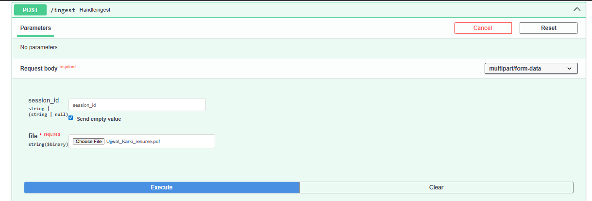

### **Ingest Response**
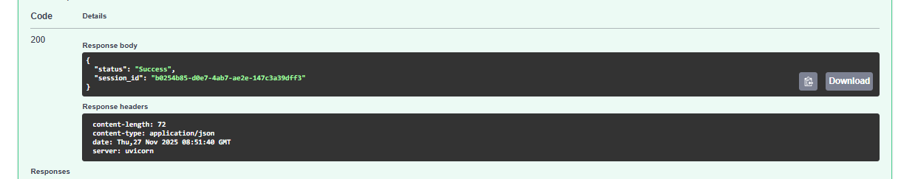

---

# 💬 **2. Chat (RAG) Flow**

### **RAG Chat Request**
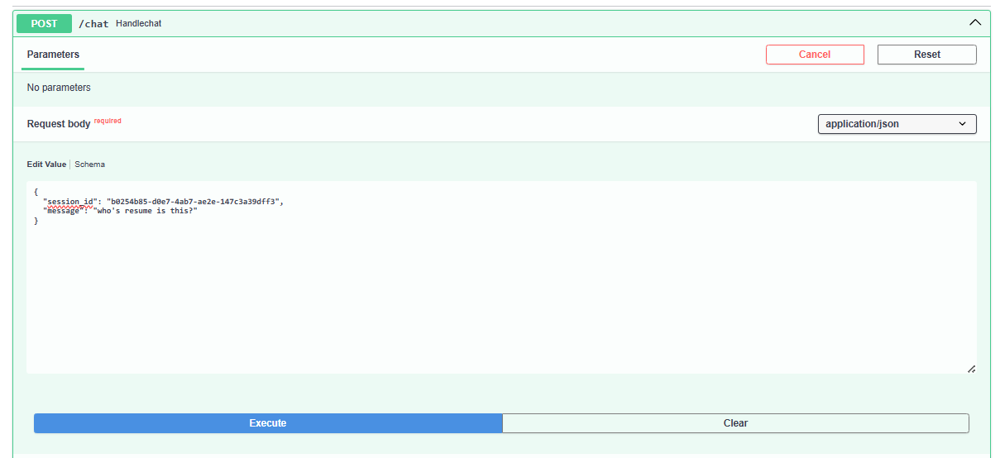

### **RAG Chat Response**
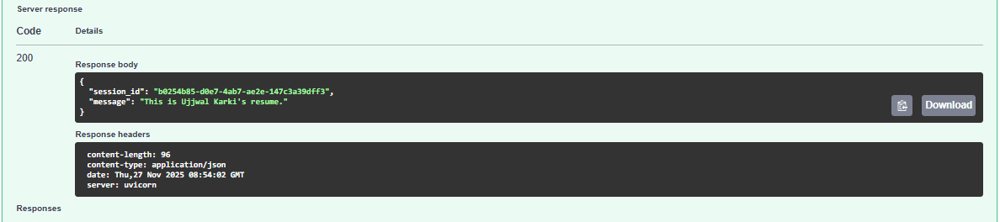

---

# 📝 **3. Interview Booking Flow**

Below is the full slot-filling sequence:  
**name → email → date → time → phone → booking confirmation**

---

## 🔹 Step 1 — User Requests Interview Booking
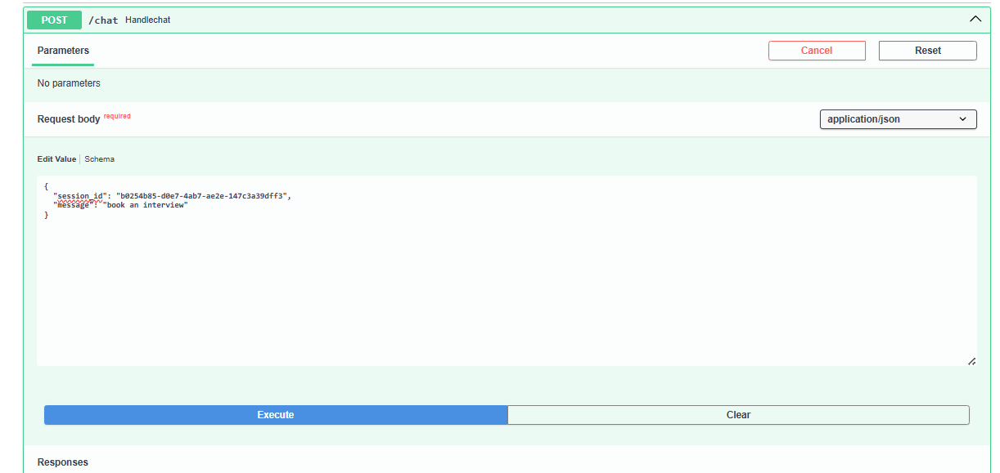

## 🔹 Step 2 — Assistant Starts Booking Flow
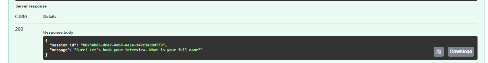

---

## 🔹 Step 3 — User Provides Name
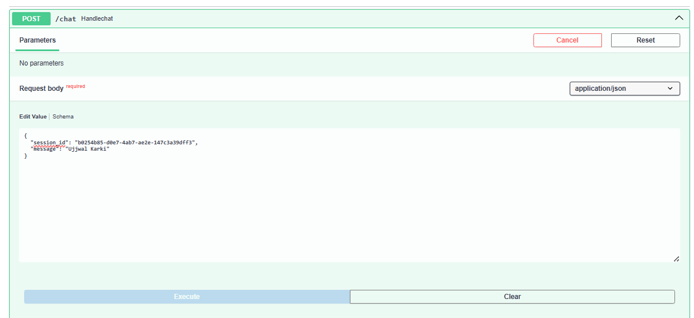

## 🔹 Step 4 — Asking for Email
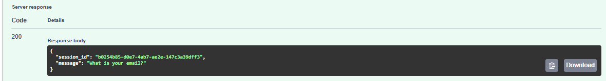

## 🔹 Step 5 — User Provides Email
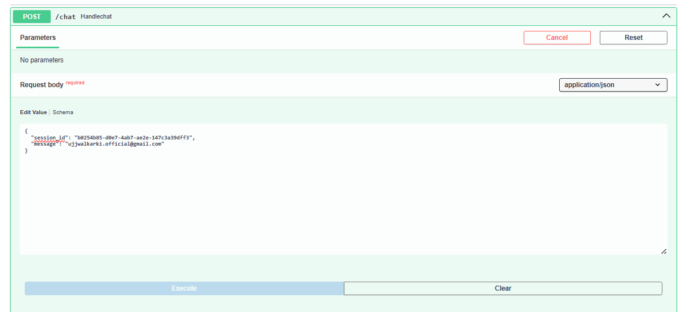

---

## 🔹 Step 6 — Asking for Date
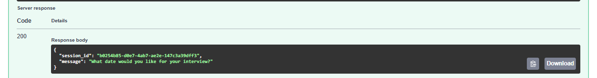

## 🔹 Step 7 — User Provides Date
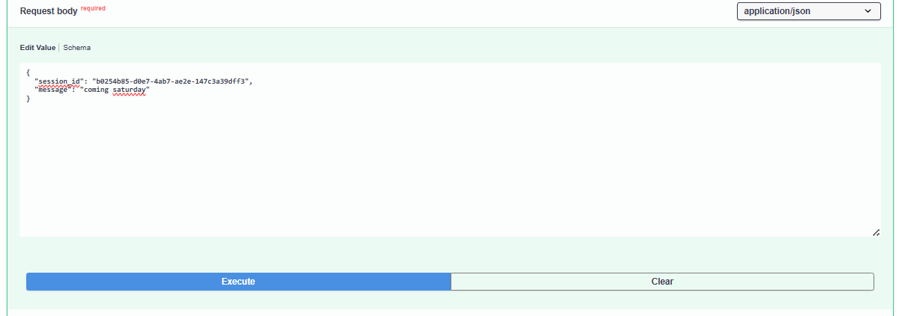

---

## 🔹 Step 8 — Asking for Time
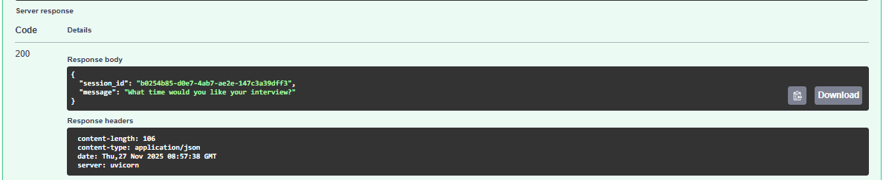

## 🔹 Step 9 — User Provides Time
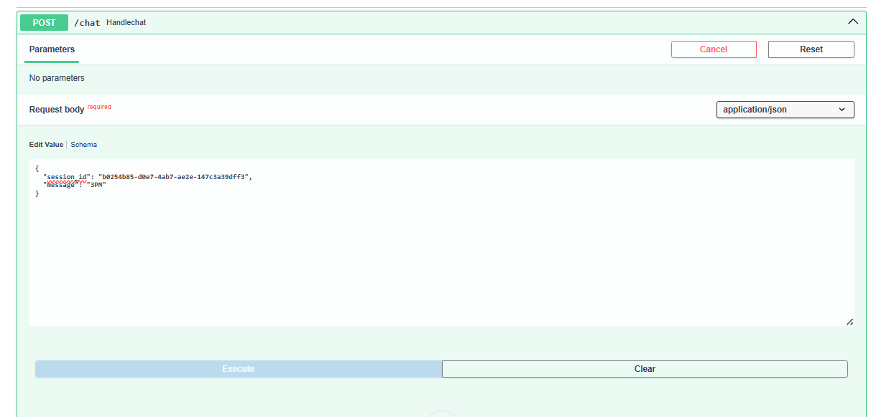

---

## 🔹 Step 10 — Asking for Phone Number
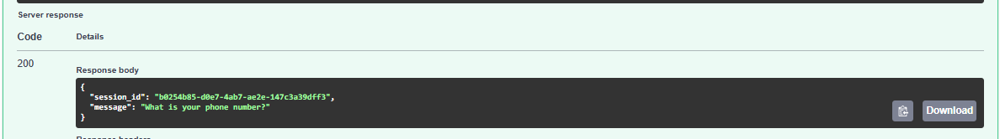

## 🔹 Step 11 — User Provides Phone Number
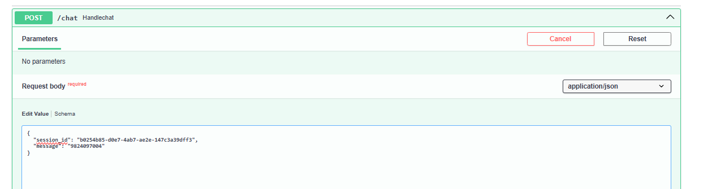

---

## ✅ Final Booking Confirmation
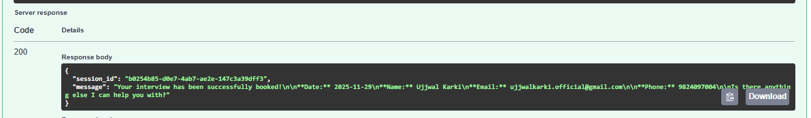

### ✅**SQLite Table (Stored Documents)**
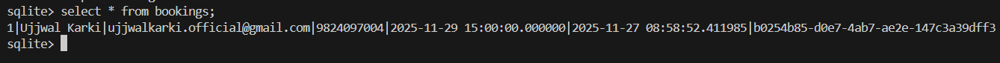

---

# 🧠 How didiAI Works

### 🔹 Session-Based Architecture
- Every ingestion & chat request includes a `session_id`.
- Documents, chat memory, and booking flow are tied to that session.

### 🔹 Intent Classification
The assistant distinguishes between:
- `normal_chat`
- `book_interview`

### 🔹 Slot Filling
Extractors gather:
- **Name**
- **Email**
- **Phone**
- **Date (YYYY-MM-DD)**
- **Time (HH:MM)**

### 🔹 RAG Retrieval
Only documents associated with the current `session_id` are used for context-aware responses.

### 🔹 SQLite Bookings
Final structured booking is stored as:

| Field | Value |
|-------|--------|
| name | user-provided |
| email | extracted |
| phone | extracted |
| date_time | combined UTC datetime |
| session_id | conversation session |

---

# 🚀 Running the Project

### Install Dependencies
```bash
pip install -r requirements.txt
